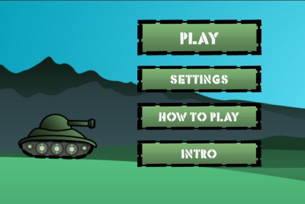

# Tank game
Unity 2d shooting tank game in experimental phase.

## Issues
Moving system has to be done differently. Right now the tank is a 2d rigid body which stands and moves on the ground using Unity's 2d physics. It doesn't work very well with curvy terrain that is used in the game.